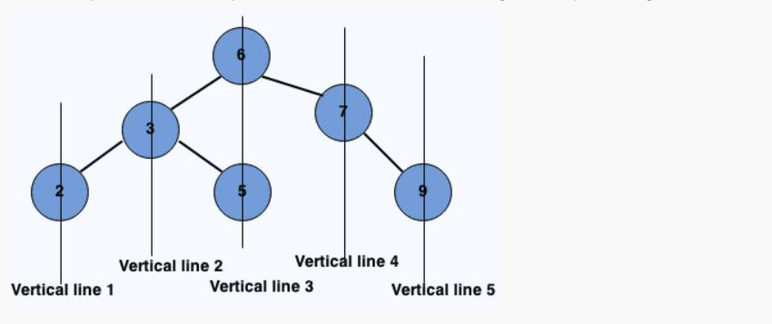

###Problem Description
```
Given a binary tree, return a 2-D array with vertical order traversal of it. Go through the example and image for more details.
```


```
NOTE: If 2 Tree Nodes shares the same vertical level then the one with lesser depth will come first.
```


###Problem Constraints
```
0 <= number of nodes <= 10^5
```


###Input Format
```
First and only arument is a pointer to the root node of binary tree, A.
```


###Output Format
```
Return a 2D array denoting the vertical order traversal of tree as shown.
```


###Example Input
####Input 1:
```
        6
      /   \
     3     7
    / \     \
   2   5     9
```
####Input 2:
```
          1
        /   \
       3     7
      /       \
     2         9

```
###Example Output
####Output 1:

```
[
    [2],
    [3],
    [6, 5],
    [7],
    [9]
]
```
####Output 2:

```
[
    [2],
    [3],
    [1],
    [7],
    [9]
]
```

###Example Explanation
####Explanation 1:

```
First row represent the verical line 1 and so on.
```