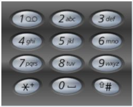

###Problem Description
```
Given a digit string A, return all possible letter combinations that the number could represent.

A mapping of digit to letters (just like on the telephone buttons) is given below.
```



```
The digit 0 maps to 0 itself. The digit 1 maps to 1 itself.

NOTE: Make sure the returned strings are lexicographically sorted.
```


###Problem Constraints
```
1 <= |A| <= 10
```


###Input Format
```
The only argument is a digit string A.
```


###Output Format
```
Return a string array denoting the possible letter combinations.
```


###Example Input
####Input 1:

```
A = "23"
```
####Input 2:

```
A = "012"
```


###Example Output
####Output 1:

```
["ad", "ae", "af", "bd", "be", "bf", "cd", "ce", "cf"]
```
####Output 2:

```
["01a", "01b", "01c"]
```


###Example Explanation
####Explanation 1:

```
There are 9 possible letter combinations.
```
####Explanation 2:

```
Only 3 possible letter combinations.
```