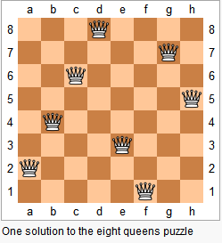

###Problem Description
```
The n-queens puzzle is the problem of placing n queens on an n×n chessboard such that no two queens attack each other.
```


```
Given an integer A, return all distinct solutions to the n-queens puzzle.

Each solution contains a distinct board configuration of the n-queens' placement, where 'Q' and '.' both indicate a queen and an empty space respectively.
The final list should be generated in such a way that the indices of the queens in each list should be in reverse lexicographical order.
```

###Problem Constraints
```
1 <= A <= 10
```


###Input Format
```
First argument is an integer n denoting the size of chessboard
```


###Output Format
```
Return an array consisting of all distinct solutions in which each element is a 2d char array representing a unique solution.
```


###Example Input
####Input 1:

```
A = 4
```
####Input 2:

```
A = 1
```


###Example Output
####Output 1:

```
[
    [".Q..",  // Solution 1
    "...Q",
    "Q...",
    "..Q."],
    
    
    
    ["..Q.",  // Solution 2
    "Q...",
    "...Q",
    ".Q.."]
]
```
####Output 1:

```
[
    [Q]
]
```

###Example Explanation
####Explanation 1:

```
There exist only two distinct solutions to the 4-queens puzzle:
```
####Explanation 1:

```
There exist only one distinct solutions to the 1-queens puzzle:
```