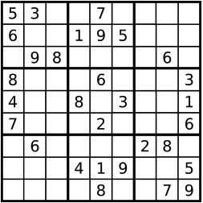
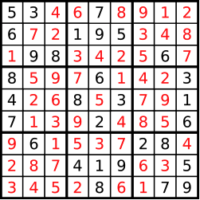

###Problem Description
```
Write a program to solve a Sudoku puzzle by filling the empty cells. Empty cells are indicated by the character '.' You may assume that there will be only one unique solution.
```



```
A sudoku puzzle, and its solution numbers marked in red.
```



###Problem Constraints
```
N = 9
```


###Input Format
```
First argument is an array of array of characters representing the Sudoku puzzle.
```
###Output Format
```
Modify the given input to the required answer.
```


###Example Input
####Input 1:

```
A = [
        [53..7....], 
        [6..195...], 
        [.98....6.], 
        [8...6...3], 
        [4..8.3..1], 
        [7...2...6], 
        [.6....28.], 
        [...419..5], 
        [....8..79]
    ]
```

###Example Output
####Output 1:

```
[
    [534678912], 
    [672195348], 
    [198342567], 
    [859761423], 
    [426853791], 
    [713924856], 
    [961537284], 
    [287419635], 
    [345286179]
]
```

###Example Explanation
####Explanation 1:

```
Look at the diagrams given in the question.
```