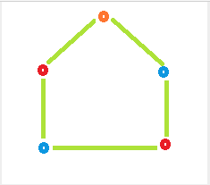

###Problem Description
```
Given the number of vertices A in a Cyclic Graph.

Your task is to determine the minimum number of colors required to color the graph so that no two Adjacent vertices have the same color.


A cyclic graph with A vertices is a graph with A edges, such that it forms a loop. See example test case explanation for more details.
```


###Problem Constraints
```
3 <= A <= 10^9
```


###Input Format
```
First argument is an integer A denoting the number of vertices in the Cyclic Graph.
```


###Output Format
```
Return an single integer denoting the minimum number of colors required to color the graph so that no two Adjacent vertices have the same color.
```


###Example Input
####Input 1:

```
5
```
####Input 2:

```
4
```


###Example Output
####Output 1:

```
3
```
####Output 2:

```
2
```


###Example Explanation
####Explanation 1:


```
Color required = 3
```
####Explanation 2:


```
Color required = 2
```