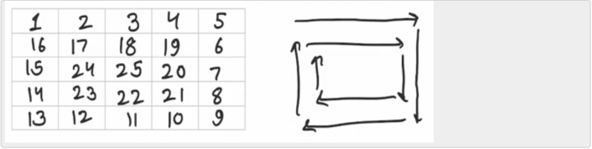

###Problem Description
```
Given an integer A, generate a square matrix filled with elements from 1 to A2 in spiral order and return the generated square matrix.
```

###Problem Constraints
```
1 <= A <= 1000
```

###Input Format
```
First and only argument is integer A
```


###Output Format
```
Return a 2-D matrix which consists of the elements added in spiral order.
```


###Example Input
####Input 1:

```
1
```
####Input 2:

```
2
```
####Input 3:

```
5
```


###Example Output
####Output 1:

```
[ [1] ]
```
####Output 2:

```
[ [1, 2], [4, 3] ]
```
####Output 3:

```
[ [1, 2, 3, 4, 5], [16, 17, 18, 19, 6], [15, 24, 25, 20, 7], [14, 23, 22, 21, 8], [13, 12, 11, 10, 9] ]
```


###Example Explanation
####Explanation 1:

```
Only 1 is to be arranged.
```
####Explanation 2:

```
1 --> 2
|
|
4<--- 3
```
####Explanation 3:

