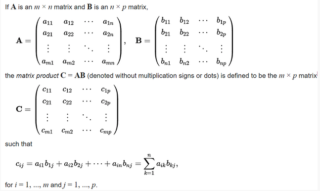

###Problem Description
```
You are given two integer matrices A(having M X N size) and B(having N X P). You have to multiply matrix A with B and return the resultant matrix. (i.e. return the matrix AB).
```



###Problem Constraints
```
1 <= M, N, P <= 100

-100 <= A[i][j], B[i][j] <= 100
```


###Input Format
```
First argument is a 2D integer matrix A.

Second argument is a 2D integer matrix B.
```


###Output Format
```
Return a 2D integer matrix denoting AB.
```


###Example Input
####Input 1:

```
A = [[1, 2],            B = [[5, 6],
     [3, 4]]                 [7, 8]]
```
####Input 2:

```
A = [[1, 1]]            B = [[2],
                             [3]]
```

###Example Output
####Output 1:

```
[[19, 22],
[43, 50]]
```
####Output 2:

```
[[5]]
```


###Example Explanation
####Explanation 1:

####Explanation 2:

```
[[1, 1]].[[2, 3]] = [[1 * 2 + 1 * 3]] = [[5]]
```