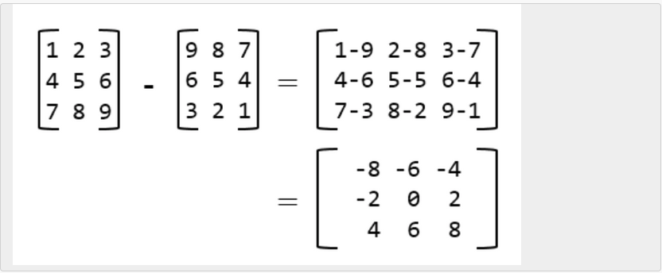

###Problem Description
```
You are given two integer matrices A and B having same size(Both having same number of rows (N) and columns (M)). You have to subtract matrix A from B and return the resultant matrix. (i.e. return the matrix A - B).

If X and Y are two matrices of the same order (same dimensions). Then X - Y is a matrix of the same order as X and Y and its elements are obtained by subtracting the elements of Y from the corresponding elements of X. Thus if Z = [z[i][j]] = X - Y, then [z[i][j]] = [x[i][j]] – [y[i][j]].
```


###Problem Constraints

```
1 <= N, M <= 10^3

-10^9 <= A[i][j], B[i][j] <= 10^9
```


###Input Format

```
First argument is a 2D integer matrix A.

Second argument is a 2D integer matrix B.
```


###Output Format

```
Return a 2D matrix denoting A - B.
```


###Example Input

####Input 1:

```
A = [[1, 2, 3],            B = [[9, 8, 7],
[4, 5, 6],                 [6, 5, 4],
[7, 8, 9]]                 [3, 2, 1]]
```
####Input 2:

```
A = [[1, 1]]               B = [[2, 3]]
```

###Example Output

####Output 1:

```
[[-8, -6, -4],
[-2, 0, 2],
[4, 6, 8]]
```
####Output 2:

```
[[-1, -2]]
```


###Example Explanation

####Explanation 1:


####Explanation 2:

```
[[1, 1]] - [[2, 3]] = [[1 - 2, 1 - 3]] = [[-1, -2]]
```